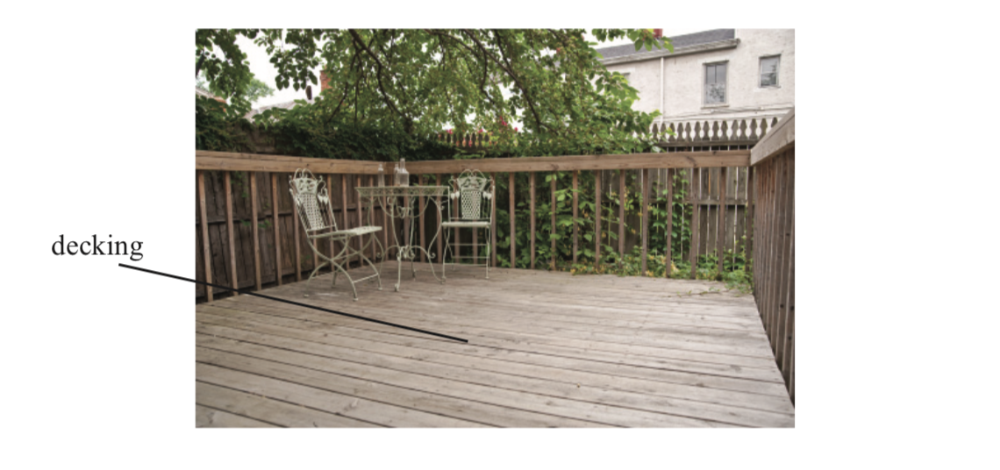
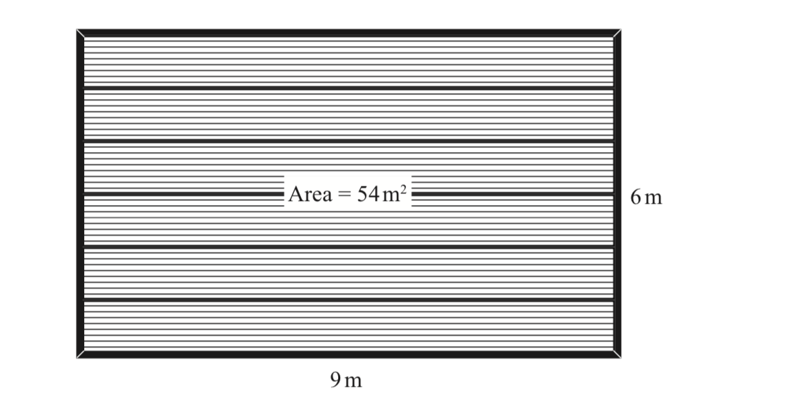
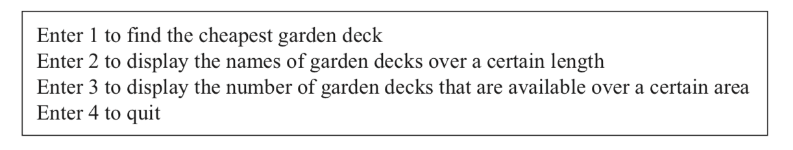
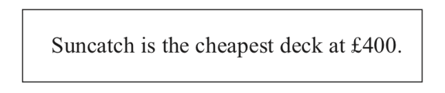
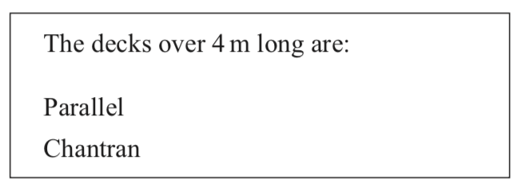
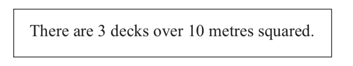

# Penny's Decking 

 

## Introduction  

Penny’s Decking supply cut-to-size garden decks to online customers.  
 

The customers can view a range of wooden decks on their website according to their length, width and area. The Chantran model is shown below.  

Following a recent survey the company have found that the majority of their online customers wish to know the answers to three questions:  

* What is their cheapest deck?  
* What decks are available above a certain length?  
* How many decks are available in a particular size?  

The company decides to write a program that will answer these questions for their customers.  

## The Task 

You have been asked to write a short program to allow the customers to query the data stored in the program.  

#### The software will:  

* Store the deck information without it having to be entered by the user.  
* Offer a choice to the customer allowing them to select the information they are looking for.  
* Find the cheapest deck in the stored deck information and display the cost.  
* Find the decks that are longer than a value entered by the user and display the names of the decks.  
* Find the total number of decks with an area larger than a value entered by the user and display the number of decks found.  

### How the program should work 

 
#### Storing the deck information the log data 
 
The program should begin by storing the information form the desks.csv file in an array of records 

#### Offer a choice to the customer  

The program should offer a menu with the following options.  

#### Find and display the cheapest deck  

The cheapest deck should be displayed as follows.  

 
#### Find and display the decks over a certain length  

The user should be asked to enter a minimum deck length between 2 and 15 metres. If the user entered 4, the list would be displayed as shown.  

#### Find and display the number of decks over a certain size  

The user should be asked to enter an area in metres squared between 4 and 80. 
If the user entered 10, the program will display the number of decks that are available above that size.  

### Main Algorithm  

1. Store the deck information  
2. Start loop  
3. Ask user for valid menu choice  
4. If option 1 selected, find and display the cheapest deck  
5. If option 2 selected, ask user for length and return decks greater than or equal to that length  
6. If option 3 selected, ask user for area and return the number of decks greater than the given area  
7. End conditional loop when ‘4’ is chosen  
8. Display an end of program message  

 
### Tasks 

1. indicate data flow in the main algorithm (**evidence** class notebook algorithm in class notebook showing the data flow – if you use the one in the task change the colour of the text) 
2. Desing the record structure to be used in the task (**evidence** a design in your class notebook) 
3. Refine steps 4,5,6 (**evidence** refinement design in your class notebook) 
4. Using Main.java implement the algorithm as a modular program using parameter passing. (**evidence** java program submitted through version control from github classroom)
5. Evaluate your program in terms of robustness (one point), fitness for purpose (one point), maintainability (one point) (**evidence** brief reports in your class notebook) 
